# Разработка бизнес-приложений

Лабораторная работа №1: аэропорт

## Запуск проекта

### Запуск backend\`а

Для запуска бэка нужно иметь на компьютере установленный docker с возможностью использования docker compose.

Все следующие команды будут работать только если перейти в директорию backend/auth.
Проект нужно запускать в Linux. Если вы работаете на Windows, просто запустите его внутри WSL Ubuntu.
Если на компьютере нет утилиты make, то можно использовать команды, псевдонимами для которых они являются.

Список всех пользователей и их пароли находятся в файле `./backend/auth/storage/fixtures/UserData.csv`

1. Администратор:
   - Почта: j.doe@amonic.com
   - Пароль: 123
2. Обычный пользователь:
   - Почта: k.omar@amonic.com
   - Пароль: 4258

Запуск бэка делится на два этапа:

1. Запуск контейнеров с помощью композ файла:

   ```
   make up
   ```

2. Заполнение базы данных информацией:
   ```
   make init_db
   ```

После запуска проекта будут доступны следующие сервисы:

1. API на golang - порт 3000
2. PHP MyAdmin (пользователь: amdin, пароль: admin) - порт 8080
3. Swagger UI - порт 5043
4. MySQL - порт 3306

Дополнительные команды:

- Для того, чтобы остановить все контейнеры нужно использовать команду:
  ```
  make stop
  ```
- Чтобы снова запустить остановленные контейнеры нужно использовать команду:
  ```
  make start
  ```
- Чтобы удалить все контейнеры для бэка нужно использовать команду:
  ```
  make down
  ```

## Запуск frontend\`a

Для того, чтобы запустить frontend данного проекта, вам нужно:

1. перейти в папку `./frontend/biznec-processy-laba-1`
2. Установить все зависимости с помощью команды

   ```sh
   npm install
   ```

3. Запустить проекта командой

   ```
   make dev
   ```

   или

   ```
   npm run dev
   ```

## Демонстрация страниц сайта

1. Главная страница
   
2. Страница логина пользователя
   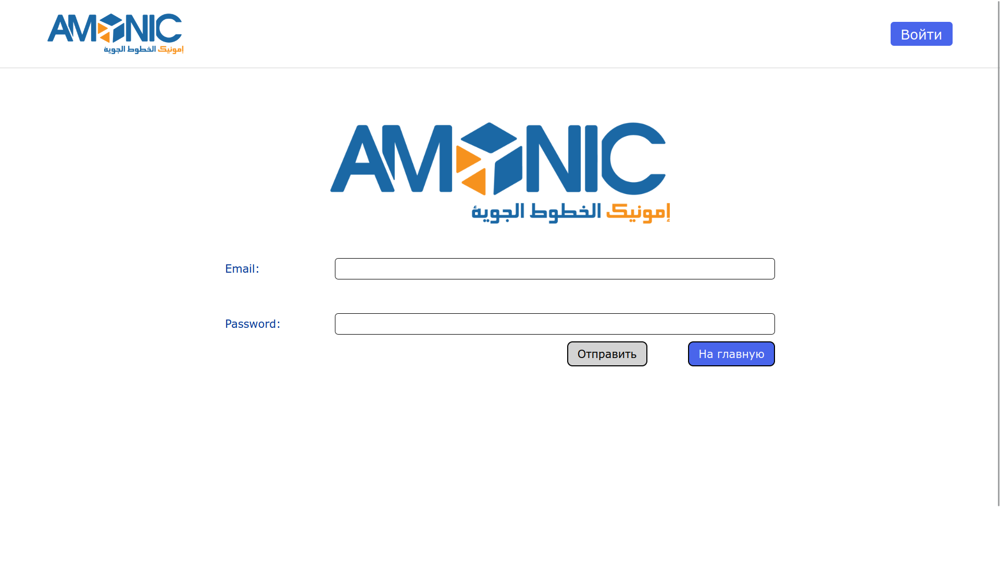
3. Личная страница пользователя, на которой отображаются непредвиденные выходы пользователя:
   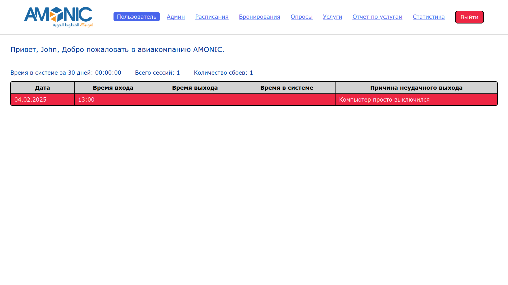
4. Модальное окно для указания причины непредвиденного выхода из системы:
   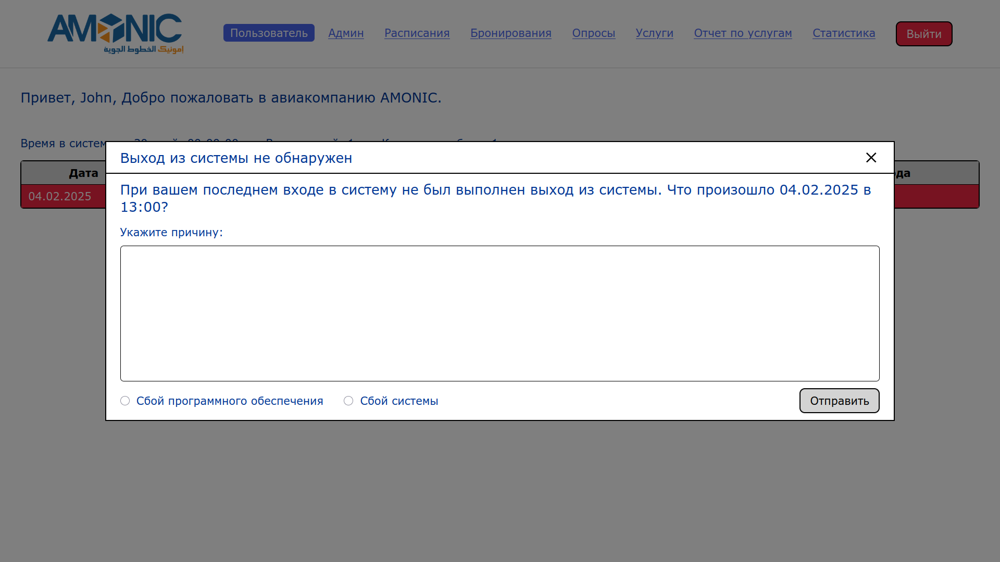
5. Страница администратора:
   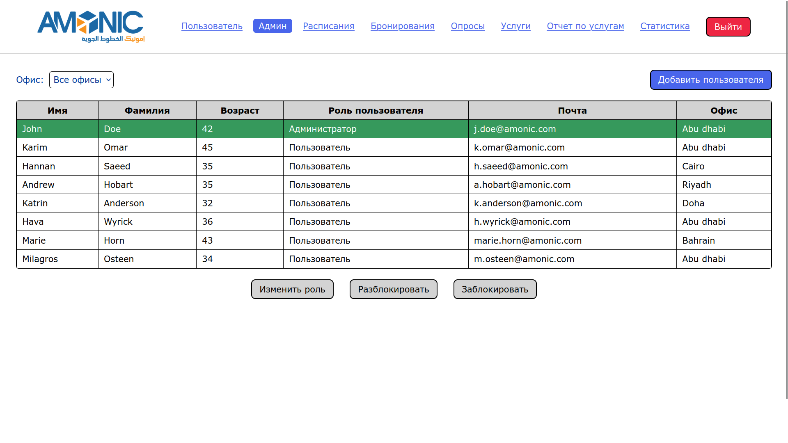
6. Модальное окно изменения информации о пользователе:
   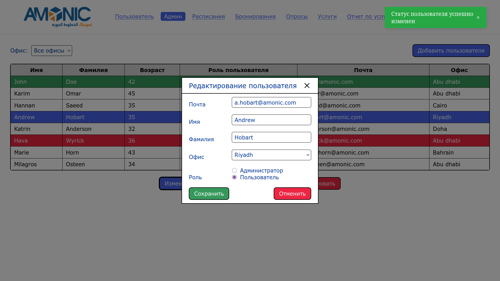
7. Модальное окно добавления нового пользователя в систему:
   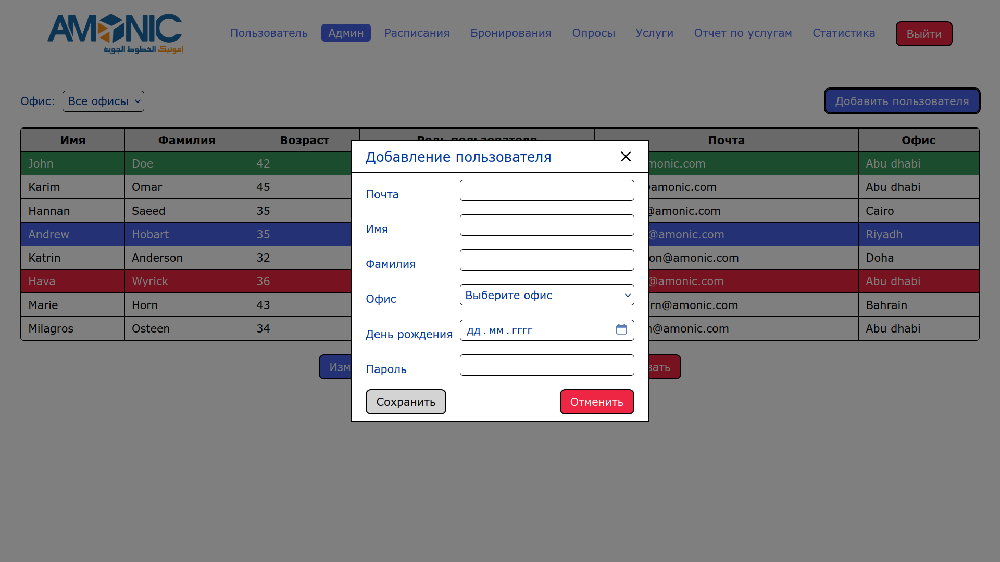
8. Страница с со всеми авиарейсами с возможностью фильтрации и отмены / подтверждения:
   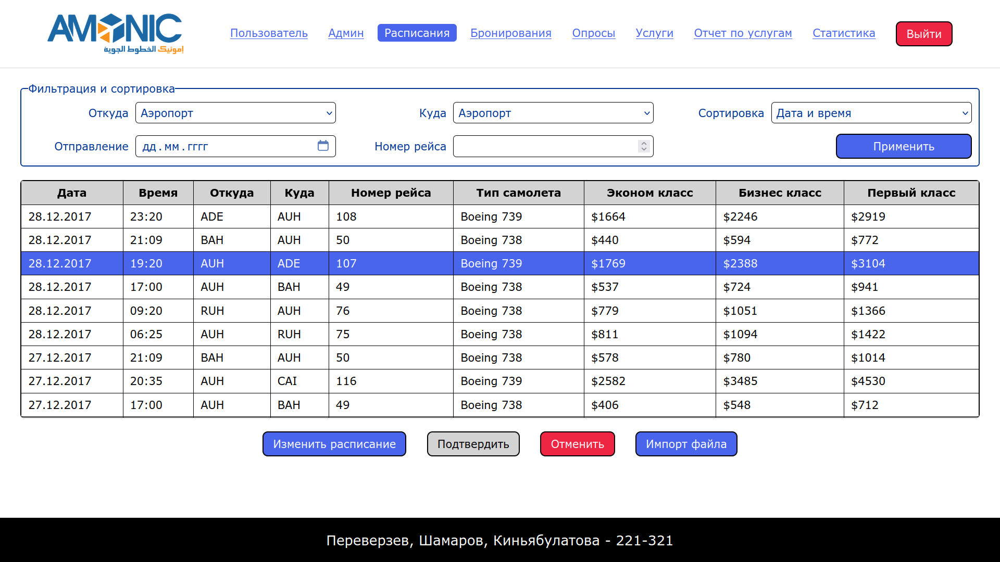
9. Модальное окно изменения информации о рейсе:
   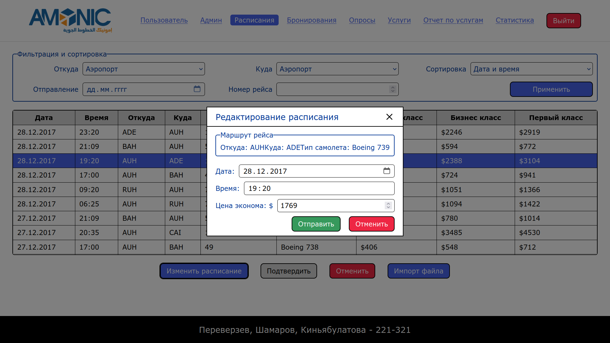
10. Модальное окно импорта расписания рейсов из csv-файла:
    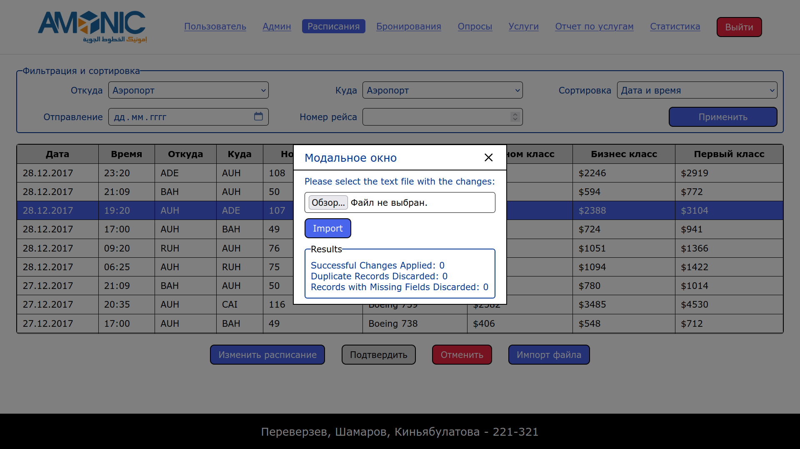
11. Страница со всеми авиарейсами с возможностью фильтрации и бронирования:
    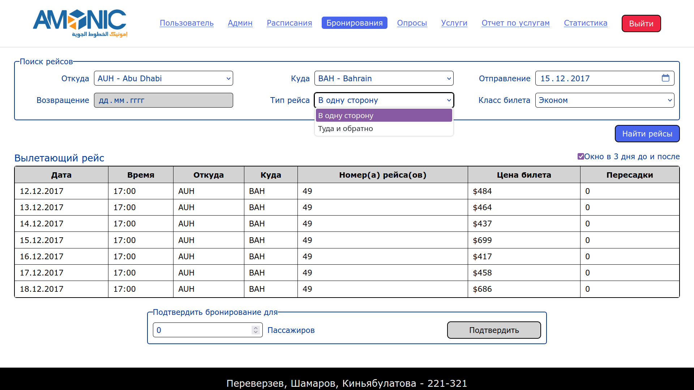
12. Модальное окно для бронирования рейса на несколько посажиров:
    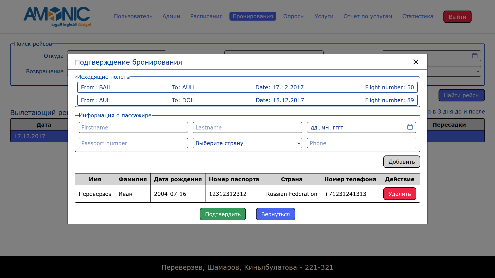
13. Модальное окно для выбора способа оплаты:
    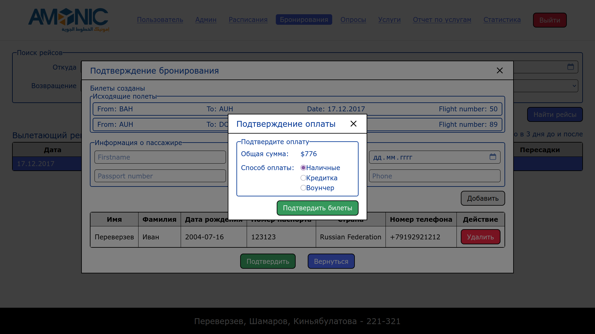
14. Страница с отчетом об опросах, которые проводила компания:
    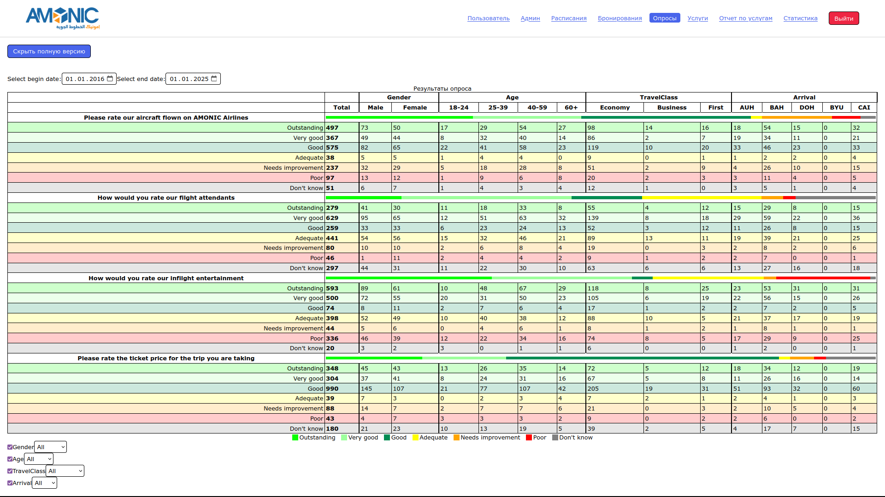
15. Страница с возможностью выбора дополнительных удобств для определенного пассажира в определенном рейсе:
    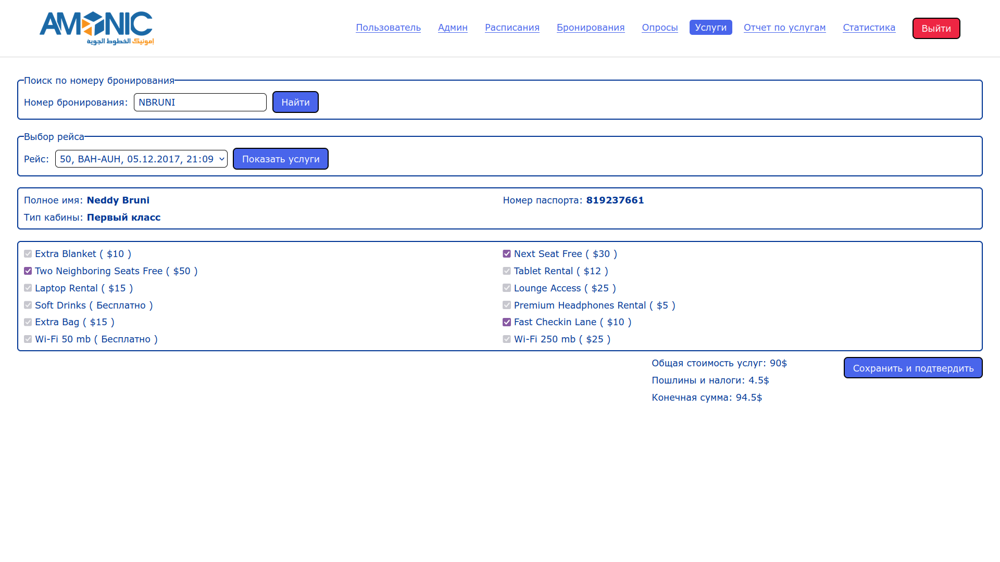
16. Страница с отчетом о деятельности компании:
    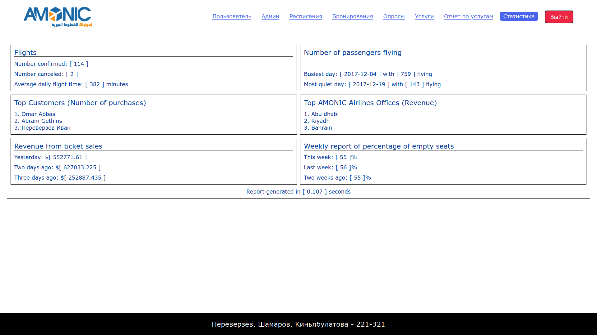
